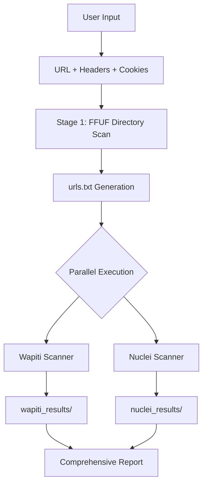

# Hacklipse - Integrated Web Vulnerability Scanner

<div align="center">

```
    __  _____   ________ __ __    ________  _____ ______
   / / / /   | / ____/ //_// /   /  _/ __ \/ ___// ____/
  / /_/ / /| |/ /   / ,<  / /    / // /_/ /\__ \/ __/
 / __  / ___ / /___/ /| |/ /____/ // ____/___/ / /___
/_/ /_/_/  |_\____/_/ |_/_____/___/_/    /____/_____/

  ___  ___ ___ _  _ _____   ___ _           _ _
 / _ \/ __|_ _| \| |_   _| | _ (_)_ __  ___| (_)_ _  ___
| (_) \__ \| || .` | | |   |  _/ | '_ \/ -_) | | ' \/ -_)
 \___/|___/___|_|\_| |_|   |_| |_| .__/\___|_|_|_||_\___|
                                 |_|
```

**Integrated Web Application Vulnerability Scanner**

[](https://python.org)
[](#license)
[](#security-notice)
[](#tools)

</div>

---

##  Overview

**Hacklipse** is an integrated web application vulnerability scanner that combines FFUF, Wapiti, and Nuclei into a streamlined two-stage pipeline. This framework automates directory discovery and comprehensive vulnerability scanning with parallel execution for maximum efficiency.

###  Key Features

- **Two-Stage Pipeline**: Directory discovery (FFUF) → Vulnerability scanning (Wapiti + Nuclei)
- **Parallel Processing**: Async execution of multiple scanners simultaneously
- **Interactive CLI**: User-friendly input with validation
- **Cookie/Header Support**: Authentication-aware scanning
- **Comprehensive Scanning**: Multiple vulnerability detection engines
- **Organized Output**: Separate directories for each tool's results

---

## 🏗️ Architecture



---

##  Installation

### Prerequisites

```bash
# Install required tools
sudo apt update && sudo apt install -y \
    ffuf \
    wapiti \
    python3 \
    python3-pip

# Install Nuclei
./install_nuclei.sh
```

### Clone & Setup

```bash
git clone https://github.com/yourusername/Hacklipse.git
cd Hacklipse

# Verify installation
ffuf -V
wapiti --version
nuclei -version
```

---

##  Usage

### Interactive Mode

```bash
python3 main.py
```

The program will prompt you for:
1. **Target URL** (e.g., `http://example.com/app`)
2. **Cookies** (optional, e.g., `sess=abc123; uid=1`)
3. **Headers** (optional, e.g., `User-Agent:curl/7.0; Accept:*/*`)

### Example Session

```
URL 입력 (예: http://yc22469.iptime.org:9991/www/homepage.html): http://hacklipse.kr
쿠키 입력 (예: sess=abc; uid=1) [없으면 엔터]: PHPSESSID=abc123
헤더 입력 (예: User-Agent:curl/7.0; Accept:*/*) [없으면 엔터]:

[INFO] 입력값 확인
  URL     : http://hacklipse.kr
  Headers : (없음)
  Cookies : PHPSESSID=abc123

이 값으로 실행하시겠습니까? (y/n): y

[+] FFUF 디렉토리 스캔 시작...
[+] 취약점 스캐너 실행 시작...
[+] 모든 스캔 완료!
```

---

##  Output Examples

### Generated Files

```
secure_ai_project/
├── urls.txt                    # Discovered URLs from FFUF
├── wapiti_results/             # Wapiti scan results
│   ├── hacklipse.kr.html       # HTML report
│   ├── hacklipse.kr.json       # JSON report
│   └── hacklipse.kr.xml        # XML report
└── nuclei_results/             # Nuclei scan results
    ├── hacklipse.kr.json       # JSON report
    └── hacklipse.kr.txt        # Text report
```

### Sample urls.txt

```
http://hacklipse.kr/api
http://hacklipse.kr/config
http://hacklipse.kr/admin
http://hacklipse.kr/uploads
http://hacklipse.kr/ping
```

---

##  Tools Integration

### Stage 1: Directory Discovery
- **FFUF**: Fast web fuzzer for directory and file discovery
  - Multi-wordlist strategy (common.txt, directories.txt, etc.)
  - Cookie and header support
  - Status code filtering (200-299, 301, 302, 401, 403)
  - Automatic URL generation to urls.txt

### Stage 2: Vulnerability Scanning (Parallel)
- **Wapiti**: Web application vulnerability scanner
  - SQL injection, XSS, CRLF, XXE detection
  - File inclusion vulnerabilities
  - Cookie-based authentication
  - Multiple output formats (HTML, JSON, XML)

- **Nuclei**: Fast vulnerability scanner with template-based detection
  - 7000+ vulnerability templates
  - Custom header/cookie support
  - Severity-based filtering (critical, high, medium, low)
  - JSON and text output formats

---

##  Use Cases

###  Security Assessment
- Comprehensive web application vulnerability scanning
- Automated directory and endpoint discovery
- Multi-engine vulnerability validation

###  Penetration Testing
- Reconnaissance automation
- Authentication-aware scanning
- Parallel scan execution for time efficiency

###  Educational Purposes
- Web security training
- Vulnerability scanning methodology
- Tool integration best practices

---

##  Project Structure

```
secure_ai_project/
├── main.py                    # Main entry point
├── scanners/                  # Scanner modules
│   ├── __init__.py
│   ├── ffuf_scanner.py       # FFUF integration
│   ├── wapiti_scanner.py     # Wapiti integration
│   └── nuclei_scanner.py     # Nuclei integration
├── install_nuclei.sh         # Nuclei installation script
├── urls.txt                  # Discovered URLs (generated)
├── wapiti_results/           # Wapiti output directory
└── nuclei_results/           # Nuclei output directory
```

---

##  Development Roadmap

- [x] **FFUF Integration**: Directory and file discovery
- [x] **Wapiti Integration**: Web vulnerability scanning
- [x] **Nuclei Integration**: Template-based scanning
- [x] **Parallel Execution**: Async scanner execution
- [ ] **Report Aggregation**: Unified vulnerability report
- [ ] **Web UI Dashboard**: Real-time scan monitoring
- [ ] **Additional Scanners**: Nikto, SQLmap integration
- [ ] **API Mode**: REST API for automation

---

##  Contributing

We welcome contributions! Feel free to submit issues or pull requests.

### Development Setup

```bash
# Fork and clone
git clone https://github.com/yourusername/Hacklipse.git
cd secure_ai_project

# Create feature branch
git checkout -b feature/new-scanner

# Make changes and test
python3 main.py

# Submit PR
git push origin feature/new-scanner
```

### Adding New Scanners

1. Create a new scanner module in `scanners/`
2. Implement `run_scan()` function
3. Add scanner to `main.py` parallel execution
4. Update README.md

---

##  License

This project is licensed under the **Educational Use License**.

###  Security Notice

**Hacklipse is designed exclusively for:**
- ✅ Authorized security testing
- ✅ Educational purposes
- ✅ Defensive security research
- ✅ Bug bounty programs

**NOT for:**
- ❌ Unauthorized access attempts
- ❌ Malicious activities
- ❌ Illegal penetration testing
- ❌ Network disruption

**Always obtain proper authorization before scanning any target.**

---

##  Acknowledgments

- **FFUF** - Fast web fuzzer by ffuf
- **Wapiti** - Web application vulnerability scanner
- **Nuclei** - Fast and customizable vulnerability scanner by ProjectDiscovery
- **SecLists** - Comprehensive wordlist collection by Daniel Miessler

---

##  Contact & Support

- **Issues**: [GitHub Issues](https://github.com/yourusername/Hacklipse/issues)
- **Email**: inuhacklipse@gmail.com

---

<div align="center">

**Built for defensive security research and authorized testing**

*"Comprehensive vulnerability scanning through tool integration"*

⭐ **Star this repo if you find it useful!** ⭐

</div>