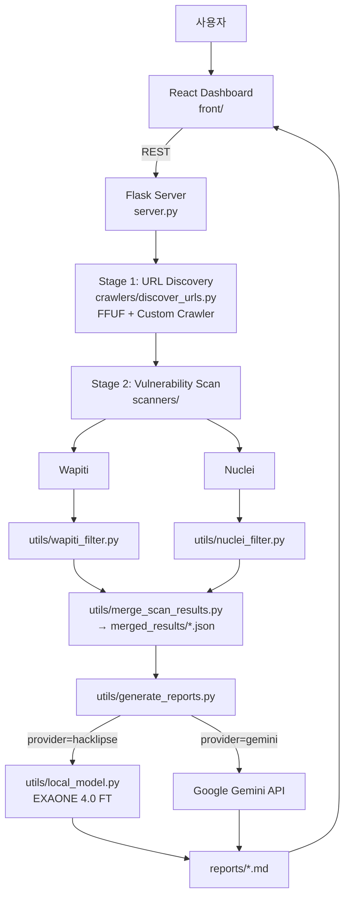

# Hacklipse — AI 기반 웹 취약점 자동 진단 및 보고서 생성 시스템

> 2026 캡스톤 디자인 프로젝트  
> 다중 스캐너로 수집한 결과를 자체 파인튜닝한 sLLM 으로 분석해, 보안 진단 보고서를 자동 생성하는 통합 플랫폼.

[](https://python.org)
[](https://react.dev)
[](https://flask.palletsprojects.com)
[](https://huggingface.co/INUHacklipse/Hacklipse-EXAONE-4.0-1.2B-Vulnreport)
[](#license)

---

## 1. 프로젝트 개요

기존 웹 취약점 스캐너(FFUF, Wapiti, Nuclei 등)는 결과 형식이 제각각이고, 보고서 작성에는 분석가의 수작업이 필요합니다. **Hacklipse** 는 이 두 단계를 하나의 파이프라인으로 연결합니다.

1. **다중 스캐너 통합 실행** — 디렉터리 탐색부터 취약점 탐지까지 자동화
2. **결과 정규화 & 병합** — 스캐너별 JSON 출력을 공통 스키마로 통일
3. **AI 보고서 생성** — 자체 파인튜닝한 EXAONE 4.0 sLLM 또는 Gemini API 로 한국어 보고서 자동 작성
4. **웹 대시보드** — React 기반 UI 로 스캔 진행 상황·이력·보고서 열람

### 핵심 차별점

- **온프레미스 가능한 sLLM**: `INUHacklipse/Hacklipse-EXAONE-4.0-1.2B-Vulnreport` — 취약점 보고서 도메인으로 파인튜닝한 1.2B 경량 모델. 외부 API 없이도 동작.
- **이중 백엔드**: 로컬 모델(`hacklipse`) ↔ Gemini API(`gemini`) 환경변수로 전환.
- **근거 기반 필터링**: 증거(Evidence) 가 부족한 항목은 보고서에서 자동 제외해 환각(Hallucination) 위험을 낮춤.

---

## 2. 시스템 아키텍처



---

## 3. 기술 스택

| 영역 | 사용 기술 |
|---|---|
| Backend | Python 3.10+, Flask, Flask-CORS, asyncio |
| Frontend | React 19, Vite, react-markdown, framer-motion |
| Scanners | FFUF, Wapiti, Nuclei (+ SecLists wordlist) |
| AI / ML | Hugging Face Transformers, PyTorch, Google Generative AI SDK |
| Fine-tuned Model | LG EXAONE 4.0 1.2B (LoRA 파인튜닝, `train/` 파이프라인) |

---

## 4. 디렉터리 구조

```
secure_ai_project/
├── main.py                       # CLI 진입점 (스캔 → 병합)
├── server.py                     # Flask API + 보고서 생성 엔드포인트
├── crawlers/
│   ├── discover_urls.py          # 1단계: URL 디스커버리
│   ├── ffuf_scanner.py           # FFUF 래퍼
│   ├── web_crawler.py            # 정적 크롤러
│   └── wordlist.txt
├── scanners/
│   ├── wapiti_scanner.py         # Wapiti 실행 및 결과 파싱
│   ├── nuclei_scanner.py         # Nuclei 실행 및 결과 파싱
│   └── nuclei-templates/         # Nuclei 템플릿 (subtree)
├── utils/
│   ├── wapiti_filter.py          # Wapiti 결과 정규화/필터링
│   ├── nuclei_filter.py          # Nuclei 결과 정규화/필터링
│   ├── merge_scan_results.py     # 스캐너별 결과 → 통합 JSON
│   ├── generate_reports.py       # AI 보고서 생성 (Gemini / Local)
│   ├── local_model.py            # 로컬 sLLM 호출 (HF Transformers)
│   └── build_train_dataset.py    # 학습 데이터셋 빌더
├── train/
│   ├── input/                    # 원천 보고서/스캔 데이터
│   └── output/                   # 학습용 JSONL
├── front/                        # React + Vite 대시보드
├── merged_results/               # 통합 스캔 결과(JSON)
├── reports/                      # 생성된 보고서(Markdown)
└── scan_status/                  # 스캔 진행 상태 파일
```

---

## 5. 설치

### 5.1 시스템 의존성

```bash
sudo apt update && sudo apt install -y ffuf wapiti python3 python3-pip

# Nuclei
./install_nuclei.sh
```

### 5.2 Python 의존성

```bash
pip install -r requirements.txt
# 로컬 모델을 쓰려면 추가
pip install torch transformers accelerate
```

### 5.3 환경 변수 (`.env`)

```dotenv
# 보고서 생성기 선택: gemini | hacklipse
AI_PROVIDER=hacklipse

# Gemini 사용 시
GEMINI_API_KEY=your_api_key_here

# (선택) Hugging Face 가중치 다운로드 가속
HF_TOKEN=your_hf_token
```

### 5.4 프론트엔드

```bash
cd front
npm install
npm run dev   # 개발 서버
# 또는
npm run build && npm run preview
```

---

## 6. 사용법

### 6.1 통합 서버 실행 (권장)

```bash
python3 server.py
# Flask API + 정적 프론트엔드 서빙
```

브라우저에서 대시보드 접속 → 대상 URL · 인증 정보 입력 → 스캔 시작 → 결과 확인 → **"AI 보고서 생성"** 클릭.

### 6.2 CLI 모드

```bash
python3 main.py
```

대화형 프롬프트로 URL · 쿠키 · 헤더를 입력하면 디스커버리부터 병합 JSON 생성까지 자동 수행됩니다.

### 6.3 보고서만 별도 생성

```bash
curl -X POST http://localhost:5000/api/generate-report/<merged_result_filename>.json
```

`AI_PROVIDER` 값에 따라 Gemini 혹은 로컬 EXAONE 모델이 사용됩니다.

---

## 7. AI 보고서 생성 파이프라인

```
merged_results/<target>_<timestamp>.json
        │
        ▼
근거(Evidence) 기반 필터  ─ 증거 부족 항목 제외
        │
        ▼
심각도/위험 점수 산출 (Critical / High / Medium / Low)
        │
        ▼
프롬프트 구성 (취약점 단위 블록 + 전체 요약)
        │
        ├─ provider=hacklipse → utils/local_model.py (EXAONE 4.0 FT)
        └─ provider=gemini    → google-generativeai SDK
        │
        ▼
reports/<target>_report_<provider>_<timestamp>.md
```

### 로컬 모델 호출 흐름

- `apply_chat_template(..., return_dict=True)` 로 인코딩 후 `model.generate(**encoded)` 호출
- 토크나이저의 `model_max_length` 를 기준으로 입력이 초과되면 **자동 분할 → 요약 → 재조립** (`_compact_prompt`)
- 출력은 마크다운 규칙(헤딩 ## 만, 한 줄 불릿, 코드성 텍스트는 코드블록) 강제

---

## 8. 모델 학습 (선택)

`train/` 에는 보고서 도메인 파인튜닝을 위한 데이터셋 빌더가 포함되어 있습니다.

```bash
# 학습용 JSONL 생성
python3 -m utils.build_train_dataset \
    --input train/input \
    --output train/output/dataset.jsonl
```

이후 LoRA / QLoRA 등 임의의 학습 프레임워크로 EXAONE 4.0 1.2B 베이스 모델을 파인튜닝합니다. 결과 어댑터를 Hugging Face Hub 에 업로드하면 `LOCAL_MODEL_NAME` 만 교체해 바로 사용 가능합니다.

### 8.1 학습 데이터셋 정책

본 저장소에는 **학습 데이터(`train/input/`, `train/output/`)가 포함되어 있지 않습니다.**

- 데이터는 교내·사내 점검 환경에서 수집된 실제 스캔 결과로 구성되며, 내부망 IP·취약 호스트 정보·재현 페이로드를 포함하므로 보안상 공개하지 않습니다.
- 파인튜닝 완료된 가중치는 별도로 공개되어 있어, **단순 사용(추론)에는 데이터셋이 필요하지 않습니다.** → [`INUHacklipse/Hacklipse-EXAONE-4.0-1.2B-Vulnreport`](https://huggingface.co/INUHacklipse/Hacklipse-EXAONE-4.0-1.2B-Vulnreport)
- 학술적 재현·평가가 필요한 경우 별도 문의해 주세요.

### 8.2 데이터셋 형식 (예시)

각 학습 샘플은 **취약점 단위**로 `input/`(원시 스캔 항목)과 `output/`(작성된 보고서 블록) 한 쌍으로 구성됩니다.

파일명 규칙:

```
train/input/<target>_<YYYYMMDD>_<HHMMSS>_<NNN>.txt
train/output/<target>_<YYYYMMDD>_<HHMMSS>_<NNN>.md
```

**`input/` 샘플 (`.txt`)**

```text
입력:
제목: XSS Filter Bypass Detection (script/on/javascript)
심각도: HIGH
카테고리: XSS
엔드포인트: http://<target>:8000, http://<target>:8000/ 외 1개
CVE: N/A
설명: Detects XSS vulnerability with filter bypass for "script", "on", "javascript:" keywords
영향: N/A
증거:
재현: curl -X 'GET' 'http://<target>:8000?q=<body+oonload=alert(1)>'
대응/조치 힌트:
```

**`output/` 샘플 (`.md`)**

```markdown
## XSS Filter Bypass Detection (script/on/javascript)
- **End-Point**: `http://<target>:8000`, `http://<target>:8000/` 외 1개
- **영향**: 악성 스크립트 실행으로 세션 쿠키 탈취, 페이지 변조, 피싱 및 개인정보 유출 가능.
- **설명**: "script", "on", "javascript:" 등 XSS 방어 키워드 필터링을 우회해 임의의 스크립트를 실행할 수 있는 취약점.
- **근거**: `curl ... 'http://<target>:8000?q=<body+oonload=alert(1)>'` 로 `q` 파라미터에 필터 우회 페이로드 주입이 가능함을 확인.
- **대응**: 사용자 입력값에 대해 화이트리스트 기반 검증을 수행하고, 모든 출력 지점에 HTML 엔티티 인코딩 적용.
- **조치**: `htmlspecialchars` 등 보안 함수로 특수 문자 치환, `Content-Security-Policy` 헤더로 인라인/원격 스크립트 실행 제한.
```

위 예시에서 `<target>` 부분에는 실제 학습 데이터에서 IP/호스트가 들어갑니다. 동일한 형식으로 직접 수집한 스캔 결과를 정리하면 자신만의 데이터셋으로 재학습할 수 있습니다.

---

## 9. 로드맵

- [x] 다중 스캐너 통합 파이프라인
- [x] 결과 정규화 / 병합
- [x] Gemini 기반 보고서 생성
- [x] 로컬 sLLM(EXAONE 4.0 FT) 기반 보고서 생성
- [x] React 대시보드 (스캔 / 보고서 열람)
- [ ] 보고서 품질 평가 지표(BLEU / 자체 Rubric) 자동화
- [ ] 멀티 타겟 동시 스캔 / 큐
- [ ] 권한 기반 인증 (대시보드 로그인)
- [ ] PDF / DOCX 보고서 내보내기

---

## 10. 보안 고지

본 시스템은 다음 용도로만 사용해야 합니다.

- 인가된 환경에서의 보안 점검
- 학술·교육 목적
- 자체 운영 자산에 대한 진단

**스캔 대상에 대한 사전 동의 없이 본 도구를 사용하는 것은 관련 법령 위반이며, 그에 따른 모든 책임은 사용자에게 있습니다.**

---

## 11. 라이선스 & 크레딧

- License: Educational Use
- Base Model: [LG AI Research — EXAONE 4.0 1.2B](https://huggingface.co/LGAI-EXAONE)
- Fine-tuned Weights: [INUHacklipse/Hacklipse-EXAONE-4.0-1.2B-Vulnreport](https://huggingface.co/INUHacklipse/Hacklipse-EXAONE-4.0-1.2B-Vulnreport)
- Scanners: [FFUF](https://github.com/ffuf/ffuf), [Wapiti](https://wapiti-scanner.github.io/), [Nuclei](https://github.com/projectdiscovery/nuclei)
- Wordlist: [SecLists](https://github.com/danielmiessler/SecLists)

---

## 12. 팀 / 문의

- Repository: <https://github.com/shinjonghyeop/Capstone>
- Hugging Face Org: <https://huggingface.co/INUHacklipse>
- Contact: inuhacklipse@gmail.com
