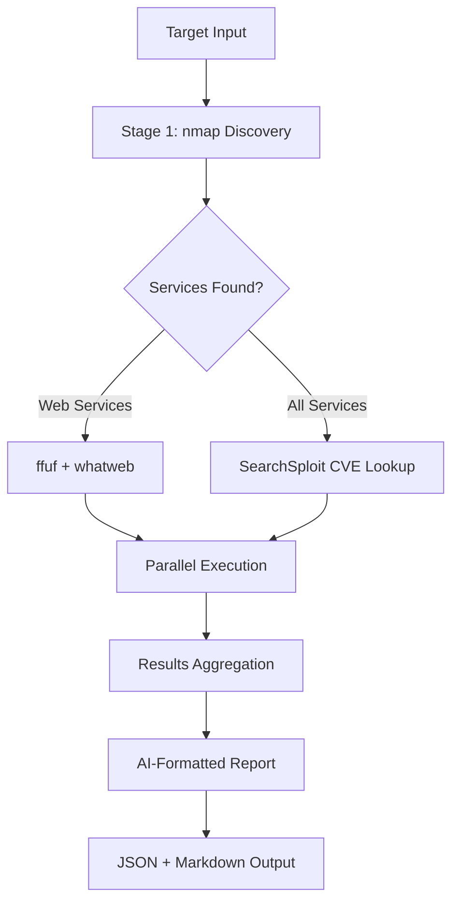

# Hacklipse - AI-Powered OSINT Pipeline

<div align="center">

```
    __  _____   ________ __ __    ________  _____ ______
   / / / /   | / ____/ //_// /   /  _/ __ \/ ___// ____/
  / /_/ / /| |/ /   / ,<  / /    / // /_/ /\__ \/ __/   
 / __  / ___ / /___/ /| |/ /____/ // ____/___/ / /___   
/_/ /_/_/  |_\____/_/ |_/_____/___/_/    /____/_____/   
                                                        
  ___  ___ ___ _  _ _____   ___ _           _ _          
 / _ \/ __|_ _| \| |_   _| | _ (_)_ __  ___| (_)_ _  ___ 
| (_) \__ \| || .` | | |   |  _/ | '_ \/ -_) | | ' \/ -_)
 \___/|___/___|_|\_| |_|   |_| |_| .__/\___|_|_|_||_\___|
                                 |_|                     
```

**Advanced OSINT Automation Framework for AI Security Research**

[](https://python.org)
[](#license)
[](#security-notice)
[](#purpose)

[한국어 README](README_ko.md) • [Documentation](docs/) • [Contributing](CONTRIBUTING.md)

</div>

---

##  Overview

**Hacklipse** is an advanced OSINT (Open Source Intelligence) automation pipeline designed for AI security research and defensive cybersecurity training. This framework combines multiple reconnaissance tools into a streamlined, intelligent workflow that generates structured datasets for machine learning applications.

###  Key Features

- **Two-Stage Pipeline**: Port discovery → Specialized scanning
- **Parallel Processing**: Async execution for maximum performance
- **AI-Ready Output**: Structured data for LLM training and analysis
- **Defensive Focus**: Ethical security research and education
- **Comprehensive Reporting**: JSON + Markdown outputs
- **CVE Integration**: Automated vulnerability discovery with SearchSploit

---

## 🏗️ Architecture



---

##  Installation

### Prerequisites

```bash
# Install required tools
sudo apt update && sudo apt install -y \
    nmap \
    whatweb \
    nikto \
    ffuf \
    searchsploit \
    python3 \
    python3-pip
```

### Clone & Setup

```bash
git clone https://github.com/yourusername/Hacklipse.git
cd Hacklipse

# Download SecLists wordlists
git clone https://github.com/danielmiessler/SecLists.git
```

---

##  Usage

### Basic Scan

```bash
# Scan localhost with SecLists
sudo python3 pipe.py -t localhost -w ./SecLists

# Scan remote target
sudo python3 pipe.py -t 192.168.1.100 -w /usr/share/seclists
```

### Advanced Options

```bash
# Verbose output with custom timeout
sudo python3 pipe.py \
    --target example.com \
    --wordlist-path ./SecLists \
    --output ./results \
    --timeout 600 \
    --verbose
```

### Command Line Options

| Option | Description | Default |
|--------|-------------|---------|
| `-t, --target` | Target IP or domain | Required |
| `-w, --wordlist-path` | SecLists directory path | Required |
| `-o, --output` | Output directory | `./` |
| `--timeout` | Tool timeout (seconds) | `300` |
| `-v, --verbose` | Detailed progress | `False` |

---

##  Output Examples

### Generated Files

```
results/
├── osint_results_target_1234567890.json      # Structured data
├── security_report_target_1234567890.md      # AI-ready report
└── temp_files/                               # Cleaned automatically
```

### Sample JSON Structure

```json
{
  "target": "localhost",
  "execution_time": "45.67초",
  "discovered_ports": {
    "80": {"service": "http", "version": "Apache 2.4.41"},
    "22": {"service": "ssh", "version": "OpenSSH 8.2"}
  },
  "cve_vulnerabilities": [
    {
      "cve": "CVE-2021-44228",
      "title": "Apache Log4j RCE",
      "service": "http",
      "port": "80"
    }
  ]
}
```

---

##  Tools Integration

### Stage 1: Discovery
- **nmap**: Port scanning, service detection, OS fingerprinting
- **XML Output**: Structured data for SearchSploit integration

### Stage 2: Specialized Scans
- **ffuf**: Directory/file fuzzing with 5-stage strategy
- **whatweb**: Technology stack identification  
- **nikto**: Web vulnerability scanning
- **SearchSploit**: CVE/exploit database lookup

---

##  Use Cases

###  Security Research
- Vulnerability assessment automation
- Attack surface mapping
- Security tool effectiveness testing

###  AI/ML Training
- Dataset generation for security models
- Attack pattern recognition training
- Automated threat intelligence

###  Educational Purposes
- Cybersecurity training environments
- Penetration testing methodology
- Defensive security awareness

---

##  Project Structure

```
Hacklipse/
├── pipe.py                 # Main OSINT pipeline
├── SecLists/              # Wordlists (git submodule)
├── hacklipse-victim/      # Vulnerable test environment
├── train/                 # ML training datasets
└── docs/                  # Documentation
```

---

##  Development Roadmap

- [ ] **Web UI Dashboard**: Real-time scan monitoring
- [ ] **Docker Integration**: Containerized scanning environment
- [ ] **Plugin System**: Custom tool integration
- [ ] **ML Models**: Built-in threat analysis
- [ ] **Report Templates**: Customizable output formats
- [ ] **API Endpoints**: REST API for automation

---

##  Contributing

We welcome contributions! Please see our [Contributing Guidelines](CONTRIBUTING.md) for details.

### Development Setup

```bash
# Fork and clone
git clone https://github.com/yourusername/Hacklipse.git
cd Hacklipse

# Create feature branch
git checkout -b feature/amazing-feature

# Make changes and test
python3 pipe.py -t localhost -w ./SecLists

# Submit PR
git push origin feature/amazing-feature
```

---

##  License

This project is licensed under the **Educational Use License** - see the [LICENSE](LICENSE) file for details.

###  Security Notice

**Hacklipse is designed exclusively for:**
- ✅ Educational purposes
- ✅ Authorized security testing
- ✅ Defensive security research
- ✅ AI/ML dataset generation

**NOT for:**
- ❌ Unauthorized access attempts
- ❌ Malicious activities
- ❌ Network disruption
- ❌ Illegal penetration testing

---

##  Acknowledgments

- **SecLists** - Comprehensive wordlist collection
- **nmap** - Network discovery and security auditing
- **OWASP** - Security testing methodologies
- **AI Security Research Community** - Continuous inspiration

---

##  Contact & Support

- **Issues**: [GitHub Issues](https://github.com/yourusername/Hacklipse/issues)
- **Discussions**: [GitHub Discussions](https://github.com/yourusername/Hacklipse/discussions)
- **Email**: inuhacklipse@gmail.com

---

<div align="center">

** Built for defensive security research and AI advancement**

*"Advancing cybersecurity through intelligent automation"*

⭐ **Star this repo if you find it useful!** ⭐

</div>